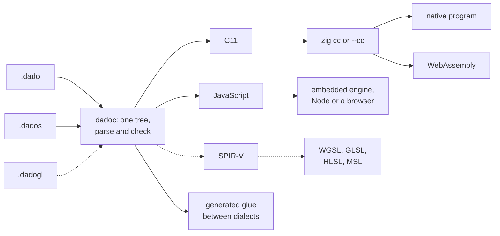

<p align="center">
  <picture>
    <source media="(prefers-color-scheme: dark)" srcset="graphics/dado-banner-dark.svg">
    
  </picture>
</p>

Dado is a programming language with three dialects: Dado for systems programming, DadoScript for scripting, and DadoGL for shaders. All three parse into one syntax tree, and that shared tree lets the compiler generate the bindings between them and optimize code across each boundary.

Dado compiles to C11, which any C compiler can build into a native program or WebAssembly. DadoScript compiles to JavaScript, which runs in a browser, under Node, or in the embedded engine: our fork of QuickJS-ng. DadoGL will compile to SPIR-V, which the toolchain translates for the graphics API you choose.

Dado 1.0 is the first public release. DadoGL is designed but not built yet: the compiler recognizes `.dadogl` files and refuses them with a message saying so.

## A note from the maintainer

> Dado is a passion project originally designed as a toy language so I could explore an idea I had for a type system. The type system is the "everything is a tuple" shape unification that Dado practices. This concept actually worked way better than I expected and I continued to develop the language. Eventually I decided I wanted to use the language in production at work for my real job and started using Claude to accelerate development. While it would be super fulfilling to spend the next 10 years of my life developing these concepts personally and maintaining my own language, I have to work for a living, and I need these tools right now. For that reason, Claude is the implementor and maintainer of most of the source code and will continue to be.
>
> While Dado was written by AI, it was designed by me in great painstaking detail. It was also written, ironically, to help me break my growing dependency on AI. I wanted a language with top shelf diagnostics and tooling that feels frictionless to the way I like to write code so I could learn to love coding again the old fashioned way. With that said, I've tried to make agentic coding as easy as possible in Dado, ensuring that agents have the tools they need to work efficiently, saving tokens and time. For many of us, AI accelerated workflows are now a permanent part of our professional lives. Rather then rage against the machine, I am embracing it's realities while giving myself the toybox I've always wanted.
>
> If you're asking why you should use Dado, then you shouldn't. Dado is inspired by many other great languages and cherry picks the features I liked most from incredible projects like Odin, Zig, and GLSL. If you are looking for a new language to call home, I would point you towards Odin and Zig. The only space in which Dado might offer some advantage over those languages is systems on the web, where my compiler can automate and optimize the boundary far further then other languages currently choose to.

## Install

Git is the only thing you need to install yourself. The installer gets everything else.

macOS and Linux:

```sh
curl -fsSL https://raw.githubusercontent.com/dadolangcom/Dado/main/install.sh | sh
```

Windows (PowerShell):

```powershell
irm https://raw.githubusercontent.com/dadolangcom/Dado/main/install.ps1 | iex
```

This downloads the latest release for your machine, checks it against the release's `SHA256SUMS`, unpacks it into `~/dado` (on Windows, `%LOCALAPPDATA%\dado`), and runs `dadoc bootstrap`. Pass `--dir` to install somewhere else, or `--version` to install a specific release.

If you downloaded the archive in a browser instead, unzip it somewhere permanent and run `sh install.sh` (on Windows, `install.bat`) from a terminal.

The installer then:

1. downloads a pinned version of [zig](https://ziglang.org) to use as the C compiler and checks its SHA-256 (a `zig` already on your PATH is used if it's the same version);
2. clones this repository at the release's tag, which brings the standard library and the vendored libraries;
3. builds `dado` and the bundled tools from source, and builds the JavaScript engine for your machine;
4. puts `dado`, `dadoc` and `dado-lsp` on your PATH (on macOS and Linux, as links in `~/.local/bin`; it never edits your shell's startup files);
5. offers to set up the editors and coding agents it finds;
6. finishes by running `dado doctor`.

Everything lives in the install folder. `dado uninstall` reverses every change the install made outside it, and a test in our suite checks that the home directory afterwards is exactly what it was before the install.

## A first program

```dado
package main

import "core:fmt"

type Point:
    f64 x,
    f64 y,

f64 dot(Point a, Point b):
    return a.x * b.x + a.y * b.y

i32 main():
    [3]Point path = ((0, 1), (3, 4), (6, 8))
    for p in path:
        fmt.println(p.x, ", ", p.y, " -> ", dot(p, path[1]))
    return 0
```

```
$ dado run hello
0, 1 -> 4
3, 4 -> 25
6, 8 -> 50
```

Everything is a tuple. Function arguments, structs, arrays, unions and multiple return values are all the same construct, and a type is a shape rather than a name. `Point` is two `f64` slots with a reading of them as `x` and `y`, which is why the compiler writes it as `Point = [2]f64`, and why a tuple literal like `(3, 4)` is already a `Point`. Unless a type is declared `distinct`, two types with the same shape are the same type, and a name only adds a way of reading it.

The whole program, imports included, becomes one C file, so there is no link step between packages.

## The toolchain

When you build or run a package, `dadoc`, the compiler, parses and checks every dialect in it as one tree. It then hands each part to the toolchain that already does that job well: C11 to a C compiler, JavaScript to an engine or a browser, and (once DadoGL is built) SPIR-V to the shader translators. Those tools do their own checking and optimization on top of ours.



Dashed lines are DadoGL, which is designed but not built.

The default C compiler is zig's, `zig cc`. It's small, and it builds for every platform Dado supports, WebAssembly included, without any other setup. Any C compiler works: pass `--cc <program>` to `dado build` or `dado run`.

| | Dialect | Files | Compiles to | Status |
|:-:|---|---|---|---|
| <picture><source media="(prefers-color-scheme: dark)" srcset="graphics/dado-dark.svg"></picture> | Dado: systems | `.dado` | C11, then native code or WebAssembly | usable |
| <picture><source media="(prefers-color-scheme: dark)" srcset="graphics/dados-dark.svg"></picture> | DadoScript: scripting | `.dados` | JavaScript, run by the embedded engine, Node or a browser | usable |
| <picture><source media="(prefers-color-scheme: dark)" srcset="graphics/dadogl-dark.svg"></picture> | DadoGL: graphics | `.dadogl` | SPIR-V, translated to WGSL, GLSL, HLSL and MSL | designed, not built |

| What you run | What it does |
| --- | --- |
| `dado` | builds, runs, tests and formats packages; installs, updates and uninstalls the toolchain; runs the bundled tools |
| `dadoc` | the compiler; `dado` calls it for you |
| `dado-lsp` | the language server your editor talks to |

The standard library lives in `collections/core`, graphics and UI in `collections/app`, and bindings to third-party C libraries in `collections/vendor`.

## Systems and scripting together

This program rolls five dice six times, names each hand, and draws a tally of every face rolled. It's three files in one package: Dado rolls and sorts the dice, DadoScript holds the scoring rules, and a small JavaScript module draws the chart.

`main.dado` keeps every face it rolls, sorts each hand with C's `qsort`, and asks the script to name it:

```dado
import "core:fmt"

// C's qsort, restated from the header. The C compiler checks the restatement.
foreign "stdlib.h":
    void qsort(rawptr base, #c.size_t count, #c.size_t size, #c.int(const rawptr, const rawptr) compare)

type Hand: [5]i64

// A small xorshift generator, so every machine rolls the same dice.
u64 seed = 4011

i64 roll():
    seed = seed ~ (seed << 13)
    seed = seed ~ (seed >> 7)
    seed = seed ~ (seed << 17)
    return i64(seed % 6) + 1

// qsort's comparator: a Dado function C calls back.
#c.int ascending(const rawptr a, const rawptr b):
    return #c.int(^i64(rawptr(a))^ - ^i64(rawptr(b))^)

!i32 main():
    try VM vm = #script_vm()
    defer #delete(vm)
    try Rules rules = #script_new(vm, Rules)
    defer #delete(rules)

    ref []i64 faces = #make([]i64, 0)
    defer #delete(faces)

    for r in 1..<7:
        Hand hand = (roll(), roll(), roll(), roll(), roll())
        qsort(rawptr(&hand), #c.size_t(#len(hand)), #c.size_t(#size(i64)), ascending)
        for d in hand:
            #append(faces, d)

        ref []char8 name = rules.score(hand[:])
        fmt.println("roll ", r, ": ", hand, "  ", name)
        #delete(name)

    ref []char8 chart = rules.tally(faces[:])
    fmt.print(chart)
    #delete(chart)
    return 0
```

`Rules.dados` is a DadoScript class. The rules live here so they can change without touching the Dado half:

```dados
class Rules

import "./bars.js"

// Names a hand of five dice, sorted low to high.
string score([]int dice):
    {int: int} counts = {}
    for d in dice:
        counts[d] = counts.get(d, 0) + 1

    []int groups = counts.values()
    groups.sort(bool(int a, int b): return a > b)
    if groups[0] >= 4:
        return "five of a kind" if groups[0] == 5 else "four of a kind"
    if groups[0] == 3:
        return "full house" if groups[1] == 2 else "three of a kind"
    if groups[0] == 2:
        return "two pairs" if groups[1] == 2 else "a pair"
    if dice[4] - dice[0] == 4:
        return "a straight"
    return "nothing"

// How often each face came up, as a bar chart.
string tally([]int faces):
    []int seen = [0, 0, 0, 0, 0, 0]
    for f in faces:
        seen[f - 1] += 1

    string chart = ""
    for n, i in seen:
        string row = bars.bar(i + 1, n)
        chart += row + "\n"
    return chart
```

`bars.js` is an ordinary JavaScript module the script imports by its path:

```js
// One row of a bar chart: the face, a bar, and the count.
export function bar(face, count) {
    return face + " " + "█".repeat(count).padEnd(12) + count;
}
```

```
$ dado run dice
roll 1: [3, 3, 3, 3, 5]  four of a kind
roll 2: [2, 3, 3, 3, 6]  three of a kind
roll 3: [4, 4, 6, 6, 6]  full house
roll 4: [3, 3, 4, 4, 5]  two pairs
roll 5: [1, 2, 3, 4, 5]  a straight
roll 6: [1, 3, 4, 5, 5]  a pair
1 ██          2
2 ██          2
3 ███████████ 11
4 ██████      6
5 █████       5
6 ████        4
```

Four calls cross a boundary, and none of them needed glue written by hand:

| Call | Crosses | What the compiler does |
| --- | --- | --- |
| `qsort(…)` | Dado to C | emits a direct call and includes the real `stdlib.h`, so the C compiler checks Dado's restatement of the signature |
| `ascending` | C to Dado | emits it as a plain C function, which C calls through a function pointer |
| `rules.score(hand[:])` | Dado to DadoScript | copies the five `i64` values into a script `[]int` for the call, and hands back the answer as a `ref []char8` that Dado owns and frees |
| `bars.bar(…)` | DadoScript to JavaScript | makes an ordinary JavaScript call; the answer is checked to be a `string` as it arrives |

The dialects meet only at declarations: a `.dados` file is a class, and Dado names it like any other type. `faces` is a `ref []i64`, which owns its memory and can grow, so `#append` works on it. `faces[:]` is a view of it, lent to the script for one call.

The C compiler is the backstop for the `foreign` block. On the web, which has no C library, the same program is refused with ERR1032, which names the `stdlib.h` block and says how to guard it with `when #OS != #WEB:`.

## Moving code across the boundary

Because both dialects are one tree, moving a function from one to the other is a compiler pass, not a rewrite. Moving DadoScript down into Dado is **lowering**. Moving Dado up into DadoScript is **raising**.

### Lowering

A DadoScript method that does only numeric work (no objects, strings, closures or `await`) is compiled as Dado, so it runs as native code instead of in the engine. You don't mark it; the compiler finds it. This method is an ordinary script:

```dados
class Physics

// How far a body falls in `steps` ticks of `dt` seconds, by Euler steps.
float fall(int steps, float dt):
    float v = 0.0
    float y = 0.0
    for i in 0..<steps:
        v += 9.81 * dt
        y += v * dt
    return y
```

Dado calls it ten million steps at a time:

```dado
import "core:fmt"
import "core:time"

!i32 main():
    try VM vm = #script_vm()
    defer #delete(vm)
    try Physics body = #script_new(vm, Physics)
    defer #delete(body)

    f64 start = time.now()
    f64 y = body.fall(10000000, 0.000001)
    fmt.println("fell ", y, " m in ", time.ms_since(start), " ms")
    return 0
```

```
$ dado run lower
fell 490.5 m in 15 ms

$ dado run lower --pass=lower=off
fell 490.5 m in 484 ms
```

The answer is the same both ways; the lowered build is about 30 times faster. `--emit=placement` lists what the compiler moved and why:

```
$ dadoc --emit=placement lower
lower.rung1	lower/Physics.dados:4:7	lowered main.Physics.fall
```

Lowered code keeps the script's meaning. A script `int` is exactly an `i64`, and a fault such as a division by zero still raises the same catchable `Error`, with the same message and location, that the script would have raised. The test suite runs every lowering test twice, lowered and unlowered, and fails on any difference in output.

In 1.0, lowering covers numeric functions and loops in native builds, and it's on by default. Static calls across the boundary, classes whose objects never reach dynamic code, and strings are the next steps, and each already has a switch reserved (`--pass=lower.rung2` to `rung4`) that does nothing yet. Web builds don't lower anything yet.

### Raising

Raising is planned, not built. It takes Dado code that uses nothing foreign (no `foreign` blocks, raw pointers or C bodies) and compiles it as DadoScript. It has two planned uses:

- **Checking:** run a Dado program and its raised twin, and compare. A difference means the two dialects disagree about what some code means.
- **Fewer crossings on the web:** a small Dado function that a script calls with JavaScript values, such as one that formats text, can run in JavaScript instead of crossing into WebAssembly and back.

Its switch, `--pass=raise`, is reserved and off.

## Interning

The compiler stores each distinct shape once, and every type with that shape refers to the same entry. This is what makes "a type is a shape" true in the generated code as well as in the checker. Here two differently named types and a bare tuple all go to one function:

```dado
package main

import "core:fmt"

type Point:
    f64 x,
    f64 y,

type Size:
    f64 w,
    f64 h,

f64 area(Size s):
    return s.w * s.h

i32 main():
    Point corner = (3, 4)
    fmt.println(area(corner), " ", area((2, 5)))
    return 0
```

```
$ dado run shapes
12 10
```

`--emit=types` shows the interned table. `Point`, `Size` and the bare `[2]f64` are three names for one C type:

```
$ dadoc --emit=types shapes
t2  arity=2  Point = [2]f64  dado_tup2_f64_f64
t3  arity=2  Size = [2]f64  dado_tup2_f64_f64
```

The emitted C declares `struct dado_tup2_f64_f64` once, and `area` takes it whichever name the caller used. Passing a `Point` where a `Size` is expected costs nothing, because there is no conversion to make. Written as `distinct type Size:`, `Size` gets its own entry, and the same two calls are refused with ERR0504.

Interning across the boundary is planned. When the compiler knows a DadoScript constant's value at build time, it will write that value straight into the Dado code or the data segment, so it never crosses at run time. The switch, `--pass=intern`, is reserved and off in 1.0.

## Cost analysis

The compiler decides where code runs from measured costs, not guesses. Each target has a cost table, `costs/native.tsv` and `costs/web.tsv`, with one row per operation: an empty loop, an integer add, a call across the boundary, a map lookup, and so on. Each row carries the time it took, the engine, the machine and the benchmark that measured it.

From those rows, the table derives the numbers the passes actually read. For example, this line works out how many 64-bit operations a script function must do per call before lowering it pays for the crossing:

```
@derive  native.lower_break_even.i64.stock
         native.crossing.stock / (native.i64_step.stock - [i64.lcg.lowered_loop|qjs-stock+c])
```

The table also states the premises the design rests on, as checks:

```
@check   native.lower_break_even.i64.stock < 1
         lowering a 64-bit loop pays at under one op per entry natively
```

If a re-measured table contradicts a check, the build stops and names the premise and the numbers, instead of a placement quietly changing underneath you.

Placement is a pure function of the source tree, the target, the cost table and the flags. Nothing is read from the environment, so two builds of the same tree with the same flags make the same decisions. Every build records what it used. `--emit=build` lists each pass that was on and the hash of the cost table it read:

```
$ dadoc --emit=build lower
pass lower
pass lower.rung1
costs costs/native.tsv sha384-fq47UvB+XBGNIR7iWaHKNTnp1RAYpDrC7vceFeMq67sE8XfRcugL1kKgo/8et1O0
```

`--emit=placement` prints one line per decision, and `--costs=<path>` builds against a table of your own, measured on your own hardware.

Today the native table has 97 operation rows (8 still to be measured), 5 derived numbers and 5 checks; the web table has 54 rows (11 to be measured), 4 derived numbers and 6 checks. They were measured on the machines we develop on. Using costs to explain a program back to you, such as per-line counts in the editor or a symbolic break-even ("lower when n > 40"), is planned.

## Owning memory and viewing it

```dado
package main

import "core:fmt"

i32 main():
    ref []i64 owned = #make([]i64, 3)
    owned[0] = 7
    #append(owned, 8)
    []i64 window = owned[:]
    fmt.println(#len(owned), " ", window[0])
    #delete(owned)
    return 0
```

```
4 7
```

Heap memory is reached only through `ref`. A `ref []i64` owns its storage and carries the allocator it came from, so it can grow, shrink and be freed. A plain `[]i64` is a view: a pointer and a length over storage it doesn't own. Views are cheap to pass around, and the compiler refuses anything that would change the storage behind them. Writing `#append(window, 8)` is refused with ERR0814, because a view has no capacity of its own to grow into.

`ref` is a capability, not a borrow checker. It doesn't track lifetimes, so it won't catch a double free.

## When it's wrong, it says why

Diagnostics name the rule that was broken and show what the compiler saw. Ask the first program for a field that isn't there:

```
error[ERR0410]: `z` names axis 2 and Point = [2]f64 has 2 slots; its axes are `x`, `y` and `r`, `g`
  --> main.dado:10:26
  10 |     return a.x * b.x + a.z * b.y
                                ^
```

Pass a number where a `Point` belongs:

```
error[ERR0504]: slot 1 of `dot` is Point = [2]f64, and this is f64
  --> main.dado:15:52
  15 |         fmt.println(p.x, ", ", p.y, " -> ", dot(p, path[1].x))
                                                          ^^^^^^^^^
```

Write another language's operator, and the diagnostic gives the line to write instead:

```
error[ERR0607]: `^` reads through a pointer; this is u64
  --> main.dado:13:5
  13 |     seed ^= seed << 13
           ^^^^^^
  help: `~` is Dado's exclusive or, and `^` is only ever the pointer's: write `seed = seed ~ (seed << 13)`
```

Every code has a longer explanation: `dado explain ERR0410`.

## Working with Dado

### The dashboard

Run `dado` with no arguments in a terminal and it opens the dashboard, a terminal UI written in Dado. From it you can build, run and test the current project with the compiler, target and sanitizer you pick, and step through diagnostics, opening each one at its line in `$EDITOR` or VS Code. It also lists every `@const` with the `-D` flag that overrides it, and shows the toolchain's version with buttons to update, upgrade or roll back. It works at 80×24, respects `NO_COLOR`, and every action is reachable from the keyboard. Outside a terminal, bare `dado` prints help.

### Editors

`dado install` finds the editors on your machine and asks once which to set up. Run `dado editors` to do it later, or `dado editors --remove` to take it back out.

| Editor | What install does |
| --- | --- |
| VS Code, Cursor, VSCodium, Windsurf | installs the Dado extension from the release, which talks to the installed `dado-lsp` |
| Neovim | adds a plugin, the tree-sitter grammar and its queries under Neovim's data folder; your `init.lua` is not touched |
| Helix | adds a marked block to `languages.toml`, which uninstall removes only if you haven't changed it |
| Emacs, Zed | prints the configuration to add yourself |

The extension always matches the toolchain, because it comes from the same release, and `dado upgrade` updates it with everything else.

### Coding agents

Dado is new, so no model has seen much of it. The toolchain is built so an agent can learn it from the compiler:

- **`AGENTS.md`** ships at the root of every release and this repository: a short primer on Dado, the write-check-fix loop, the mistakes agents make first, and how to ask for more. `dado agent` prints the copy that matches your installed version, and `dado new <name>` scaffolds a project that points to it.
- **Claude Code:** when install finds Claude Code, it offers a small plugin that registers `dado-lsp` as a language server, so every edit Claude makes is followed by the compiler's diagnostics.
- **Commands that answer by name:** `dado inspect <declaration>` prints a declaration with every outside name it uses, `dado peek <scope> <name>` resolves a name exactly as the compiler would there, `dado refs <declaration>` lists what uses it, and `dado apply <file>` writes whole declarations back across files in one step. Each answers with `--format=json` too.

## Documentation

The documentation is generated by the compiler of the release you installed, so it describes that release. The same pages are in [`docs/`](docs/) in this repository.

| Command | Shows |
| --- | --- |
| `dado doc reference` | the language reference |
| `dado doc core:strings` | one package's documentation |
| `dado api core:strings` | a package's signatures only |
| `dado explain <code>` | the full explanation of a diagnostic |
| `dado search <term>` | matches across the documentation and diagnostic titles |
| `dado agent` | the guide for AI coding agents (also [AGENTS.md](AGENTS.md)) |

Each one also answers with `--format=json`.

## Staying current

The compiler and the libraries move separately. The compiler (`dadoc` and `dado-lsp`) ships as a release; the standard library, the vendored bindings and the tools live in this repository and can change between releases.

- **New libraries:** `dado` checks at most every 15 minutes whether this repository has moved. In a terminal it asks before updating; in scripts, CI and agents it prints one line and carries on. `dado update` updates on demand, and `dado update --rollback` returns to the previous tree. It never updates past the oldest compiler the new tree needs, which is recorded in `DADOC_MIN` at the root; when that happens it tells you to upgrade instead.
- **A new compiler:** `dado upgrade` downloads the newest release for your machine, checks it against `SHA256SUMS`, swaps the binaries, and rebuilds the tools. `dado upgrade --rollback` puts the previous ones back. A new major version asks first.
- **Removing it:** `dado uninstall` undoes every change the install made outside its folder, newest first, then deletes the folder. It removes only what it put there.

Turn the check off with `--no-update-check` or `DADO_NO_UPDATE_CHECK=1`.

### Versions

Releases are numbered `major.minor.patch`, and `dadoc` and `dado-lsp` share one version. Within major version 1, the language and the diagnostic codes are stable, and `dadoc` and `dado-lsp` follow semantic versioning. The libraries and tools are in beta and promise nothing until they leave it.

## Platforms

| Release archive | Runs on | Tested |
| --- | --- | --- |
| `dado-macos-universal.tar.gz` | macOS, Apple silicon and Intel | yes |
| `dado-linux-x86_64.tar.gz` | Linux x86_64, any distribution (static) | yes |
| `dado-linux-aarch64.tar.gz` | Linux ARM64, any distribution (static) | yes |
| `dado-windows-x86_64.zip` | Windows 10 and later, x86_64 | under Wine only |

Windows is supported on a best-effort basis: we have no Windows machine, so the Windows build is cross-compiled and tested under Wine. Known Windows issues are listed in the release notes. Please report anything that breaks.

The binaries are not code-signed or notarized. The install scripts clear the "downloaded from the internet" mark that would otherwise make macOS or Windows block them.

Node is needed for one thing only: running web tests headless, with `dado test --target=web`. Installing, building for any target, running programs and serving a page don't need it.

## This repository

```
collections/core     the standard library: memory, strings, I/O, files, processes, threads, networking, …
collections/app      windows, input, drawing, UI and fonts for graphical programs
collections/vendor   bindings to enet, raylib, sokol, stb and a terminal UI
tools/               dado itself and the tools it runs: doc, webdev, dashboard
docs/                the generated documentation
graphics/            the logo and banner
```

This repository is what `dado install` clones and `dado update` keeps current. Compiler releases are on the [Releases](../../releases) page.

## How Dado is built

Claude, Anthropic's AI model, writes most of Dado's code, tests and documentation, working as a team of agents. One human maintainer designed the language, directs the work and decides what ships. Work merges only after it passes these checks:

- The compiler is the specification. There is no separate spec document to drift from it, and the reference documentation is generated from the compiler.
- The test programs are compiled by two different C compilers, GCC and Clang, and their behavior is compared.
- Generated C must compile without warnings.
- Tests run under AddressSanitizer and UndefinedBehaviorSanitizer, and threaded code under ThreadSanitizer.
- The test suite is itself tested: the compiler is deliberately broken in small ways (mutation testing), and a test has to fail each time. The last run made 121 such changes, and none went unnoticed.
- Before each release, an archive is built, installed into an empty home directory, used to build every test program, then uninstalled, and the home directory must match what it was before.

## License

MIT. Bundled third-party code keeps its own license; see [THIRD_PARTY_NOTICES](THIRD_PARTY_NOTICES).

*This README was drafted by an AI agent from the project's plans and from programs run against the compiler, and edited by the maintainer.*
