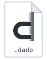
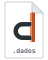

<p align="center">
  <picture>
    <source media="(prefers-color-scheme: dark)" srcset="graphics/dado-banner-dark.svg">
    
  </picture>
</p>

UNDER CONSTRUCTION - the toolchain and deployment automation is being polished right now, check back in a week or so and Dado should be live.

SOURCE - the source code will never be available at this repo, this repo is intended for compiler builds, docs and tooling only. Dado source code is currently private but will be open sourced once the language is stable. The Dado project is licensed under the MIT license.

Dado is a programming language with dialects for systems programming, scripting and GPU
programming. The dialects share a single syntax tree and one compiler, and the compiler generates
the glue between them. Systems code compiles to C11, which any C compiler can build into a native
program or WebAssembly. Scripts compile to JavaScript and run in an embedded engine, under Node or
in a browser. Shaders compile to SPIR-V, which the toolchain translates for each graphics API.

Dado is early. Versions start with 0, and a minor release may change the language. DadoGL, the
graphics dialect, is designed but not built: the compiler recognises its files and refuses them
with a message saying so.

## A first program

```dado
package main

import "core:fmt"

type Point:
    f64 x,
    f64 y,

f64 dot(Point a, Point b):
    return a.x * b.x + a.y * b.y

i32 main():
    [3]Point path = ((0, 1), (3, 4), (6, 8))
    for p in path:
        fmt.println(p.x, ", ", p.y, " -> ", dot(p, path[1]))
    return 0
```

```
$ dado run hello
0, 1 -> 4
3, 4 -> 25
6, 8 -> 50
```

Everything is a tuple. Function arguments, structs, arrays, unions and multiple return values
are all the same construct, and a type is a shape rather than a name. `Point` is two `f64` slots
with a reading of them as `x` and `y`, which is why the compiler writes it as `Point = [2]f64`
below, and why a tuple literal like `(3, 4)` is already a `Point`. Unless a type is declared
`distinct`, two types with the same shape are the same type, and a name only adds a way of
reading it.

The whole program, imports included, becomes one C file, so there is no link step between
packages.

## Owning memory and viewing it

```dado
package main

import "core:fmt"

i32 main():
    ref []i64 owned = #make([]i64, 3)
    owned[0] = 7
    #append(owned, 8)
    []i64 window = owned[:]
    fmt.println(#len(owned), " ", window[0])
    #delete(owned)
    return 0
```

```
4 7
```

Heap memory is reached only through `ref`. A `ref []i64` owns its storage and carries the
allocator it came from, so it can grow, shrink and be freed. A plain `[]i64` is a view: a pointer
and a length over storage it doesn't own. Views are cheap to pass around, and the compiler refuses
anything that would change the storage behind them. Writing `#append(window, 8)` is an error
(ERR0814), because a view has nothing it could grow. `ref` is a capability, not a borrow checker:
it doesn't track lifetimes, so it won't catch a double free.

## When it's wrong, it says why

Diagnostics name the rule that was broken and show what the compiler saw. Ask for a field that
isn't there:

```
error[ERR0410]: `z` names axis 2 and Point = [2]f64 has 2 slots; its axes are `x`, `y` and `r`, `g`
  --> main.dado:10:26
  10 |     return a.x * b.x + a.z * b.y
                                ^
```

Pass a number where a `Point` belongs:

```
error[ERR0504]: slot 1 of `dot` is Point = [2]f64, and this is f64
  --> main.dado:15:52
  15 |         fmt.println(p.x, ", ", p.y, " -> ", dot(p, path[1].x))
                                                          ^^^^^^^^^
```

Every code has a longer explanation: `dado explain ERR0410`.

## Three dialects

| | Dialect | Files | Compiles to | Status |
|:-:|---|---|---|---|
| <picture><source media="(prefers-color-scheme: dark)" srcset="graphics/dado-dark.svg"></picture> | Dado: systems | `.dado` | C11, then native code or WebAssembly | usable |
| <picture><source media="(prefers-color-scheme: dark)" srcset="graphics/dados-dark.svg"></picture> | DadoScript: scripting | `.dados` | JavaScript, run by an embedded engine, Node or a browser | usable |
| <picture><source media="(prefers-color-scheme: dark)" srcset="graphics/dadogl-dark.svg"></picture> | DadoGL: graphics | `.dadogl` | SPIR-V, which the toolchain translates to WGSL, GLSL, HLSL and MSL | designed, not built |

The dialects meet at declarations. DadoScript code is written as classes, either in `.dados`
files or in `class` blocks inside a Dado package. Dado code creates instances and calls their
methods, and scripts call Dado functions by name. The compiler checks both sides and generates
the code that crosses between them, including the boundary between WebAssembly and JavaScript
when a program runs in a browser.

DadoGL compiles to SPIR-V and nothing else. The toolchain then uses established third-party
translators to turn SPIR-V into WGSL (WebGPU), GLSL (OpenGL), HLSL (Direct3D) and MSL (Metal), so
one shader source serves every backend.

## Install

You need git and a network connection. The release archive holds the compiler, `dadoc`, and the
source of the `dado` command.

```sh
# macOS and Linux: unpack somewhere permanent, then
./dadoc bootstrap
```

```powershell
# Windows
.\dadoc.exe bootstrap
```

`dadoc bootstrap` downloads a pinned version of [Zig](https://ziglang.org) to use as the C
compiler (or uses a matching `zig` already on your PATH), builds `dado` from source, and runs
`dado install`. That puts `dado` on your PATH and builds the bundled tools. Everything lives in
the folder you unpacked, and `dado uninstall` removes every change install made outside it.

## Documentation

The documentation is generated by the compiler of the release you installed, so it describes
that release.

| Command | Shows |
|---|---|
| `dado doc reference` | the language reference |
| `dado doc core:strings` | one package's documentation |
| `dado api core:strings` | a package's signatures only |
| `dado explain <code>` | the full explanation of a diagnostic |
| `dado agent` | the quickstart for AI coding agents (also [AGENTS.md](AGENTS.md)) |

## This repository

```
collections/core     the standard library: memory, strings, I/O, threads, networking, HTTP, …
collections/app      windows, input, drawing, UI and fonts for graphical programs
collections/vendor   bindings to enet, raylib, sokol, stb and a terminal UI
tools/               dado itself and the tools it runs: doc, webdev, dashboard
```

Each part has its own version (see Versions). Releases of the compiler are on the
[Releases](../../releases) page.

## How Dado is built

Claude, Anthropic's AI model, writes most of Dado's code, tests and documentation, including
this file, working as a team of agents. One human maintainer designed the language, directs the
work and decides what ships. Work merges into the main branch only after it passes
these checks:

- The compiler is the specification. There is no separate spec document to drift from it, and
  the reference documentation is generated from the compiler.
- The test programs are compiled by two different C compilers, GCC and Clang, and their behaviour
  is compared.
- Generated C must compile without warnings.
- Tests run under AddressSanitizer and UndefinedBehaviorSanitizer, and threaded code under
  ThreadSanitizer.
- The test suite is itself tested: the compiler is deliberately broken in small ways (mutation
  testing), and a test has to fail each time.

## Versions

A version is `major.minor.patch`. Every part of a release (the compiler, each collection, each
tool) shares the same `major.minor`, and parts with the same `major.minor` work together whatever
their patch numbers. A patch never changes a public API. `dado update` installs new patches;
`dado upgrade` moves to a new minor version when you choose to.

## A note from the maintainer

Dado is a passion project originally designed as a toy language so I could explore an idea I had
for a type system. The type system is the "everything is a tuple" shape unification that Dado
practices. This concept actually worked way better than I expected and I continued to develop the
language. Eventually I decided I wanted to use the language in production at work for my real job
and started using Claude to accelerate development. While it would be super fulfilling to spend
the next 10 years of my life developing these concepts personally and maintaining my own language,
I have to work for a living, and I need these tools right now. For that reason, Claude is the
implementor and maintainer of most of the source code and will continue to be.

Dado was never meant to replace any other language out there or even be a legitimate alternative
to anything. It's written for me, so I can write code the way I like to write code, and
specializes in automating the things I don't like doing: namely, the boundaries between wasm/js
and systems/graphics languages. Its memory semantics using the `ref` type also exist to keep the
concept of memory ownership and memory viewership explicit. Every decision Dado makes in its
design is there to cater to my weaknesses, and is not an opinion or statement about how
"programming done right" looks.

## License

MIT. Bundled third-party code keeps its own license; see
[THIRD_PARTY_NOTICES](THIRD_PARTY_NOTICES).
